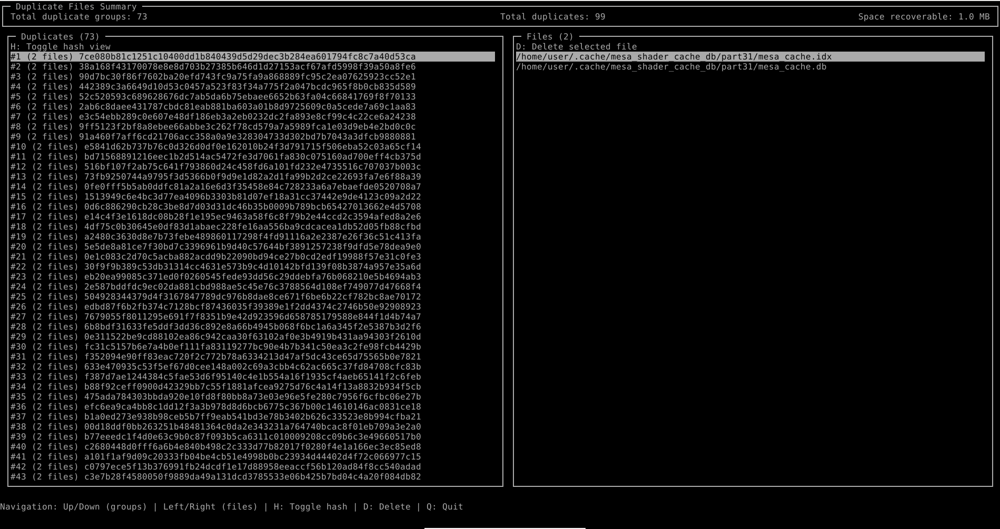

# duplicate-file-manager
  



dfm is a command line tool to manage your duplicated files in your system. This program was primarily made to practice coding in Ada, and because its author makes random copies of its files too much and needed a tool to delete all the useless ones.


**Disclamer** : the program is given as-is and the author won't be responsible if you misclick and actually delete an important file :)

## Installation
### Prerequisites
**Debian like os :**

You need gnat, and some libraries to be able to compile this project. All of them can be installed using `apt` by running the following command :

`sudo apt install gnat gprbuild libncurses-dev libncursesada-dev`

`libncurses` is needed for the terminal user interface (tui) to work. `libncursesada-dev` is ncurses Ada bindings.

### Build
To build the application, run the following command :

`gprbuild -d -P./duplicate-file-manager.gpr && sudo gprinstall -p -f -P./duplicate-file-manager.gpr --prefix=/usr --mode=usage`

A whole command could be :

```
git clone https://github.com/Bros-Insanity/duplicate-file-manager && cd duplicate-file-manager && gprbuild -d -P./duplicate_file_manager.gpr && sudo gprinstall -p -f -P./duplicate_file_manager.gpr --prefix=/usr --mode=usage
```

## Usage
```
dfm [OPTIONS]
"Options:"
  -h, --help   Displays help."
  -f, --folder PATH   Specify research folder. If no path is provided, default path is $HOME."
  -i, --ignore PATH   Path to ignore file."
                      Ignore file is a txt file that must contain each path, folder names or file names to be ignored during the research. The file must contain one (1) path or name per line."
  -s, --sample PATH   Get an ignore file sample at chosen path. If no path is provided, default path is $HOME."
```

When navigating through files, you can press D to delete the selected file. This will open a confirmation pop-up and the file will be deleted if you press Y (yes).

The tests were done on a Debian 13 system. Portage to Windows and macOS is considered...